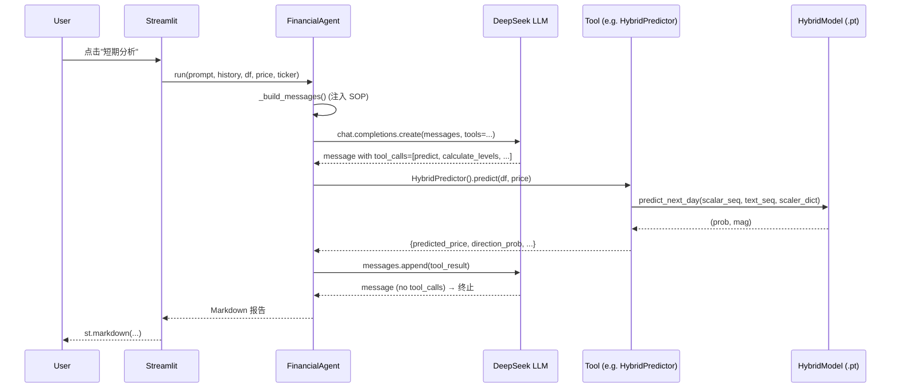

# 01 · 系统架构

> 深入解析 FinanceAgentV2.0 的整体架构、双脑协同机制、消息流与关键抽象。

---

## 1. 总体架构图

```
┌─────────────────────────────────────────────────────────────────────┐
│                         用户交互层 (Streamlit)                       │
│   frontend/app.py                                                    │
│   ┌──────────┬──────────┬──────────┬───────────┬──────────────────┐│
│   │ 股票K线  │ 技术指标  │ 情感曲线 │ AI 对话框  │ 关键指标仪表盘    ││
│   └────┬─────┴────┬─────┴────┬─────┴─────┬─────┴─────────┬────────┘│
└────────┼──────────┼──────────┼───────────┼───────────────┼─────────┘
         │          │          │           │               │
         │          │          │           ▼               │
         │          │          │   FinancialAgent.run()    │
         │          │          │   (DeepSeek V3)            │
         │          │          │           │               │
         │          │          │           ▼               │
         │          │          │   tool_registry.TOOL_MAPPING
         │          │          │           │               │
         │          ▼          ▼           ▼               ▼
│   ┌────────────────────────────────────────────────────────────┐
│   │              量化工具链（agents/Tools/）                     │
│   │  ┌──────────────┐ ┌──────────────┐ ┌──────────────┐       │
│   │  │ FinBERT      │ │ Hybrid       │ │ Support/     │       │
│   │  │ Analyzer     │ │ Predictor    │ │ Resistance   │       │
│   │  └──────────────┘ └──────────────┘ └──────────────┘       │
│   │  ┌──────────────┐ ┌──────────────┐ ┌──────────────┐       │
│   │  │ Similarity   │ │ Macro        │ │ Financial    │       │
│   │  │ Searcher     │ │ Analyzer     │ │ Statement    │       │
│   │  └──────────────┘ └──────────────┘ └──────────────┘       │
│   └────────────────────────────────────────────────────────────┘
                                 │
                                 ▼
│   ┌────────────────────────────────────────────────────────────┐
│   │                  深度学习模型层 (models/)                    │
│   │  ┌────────────────────────┐  ┌──────────────────────────┐  │
│   │  │ HybridModel            │  │ FinBERT (本地)            │  │
│   │  │  ├─ TemporalTower      │  │  yiyanghkust/finbert-tone│  │
│   │  │  │   2×LSTM(256)        │  └──────────────────────────┘  │
│   │  │  ├─ TextTower          │                                │
│   │  │  │   4×Transformer(768)│                                │
│   │  │  ├─ FusionLayer        │                                │
│   │  │  │   CrossAttn+Gate    │                                │
│   │  │  └─ ClsHead + RegHead │                                │
│   │  └────────────────────────┘                                │
│   └────────────────────────────────────────────────────────────┘
                                 │
                                 ▼
│   ┌────────────────────────────────────────────────────────────┐
│   │                       数据层 (datas/)                       │
│   │   stock_datas.csv  ·  stock_datas_vif.csv  ·  ...           │
│   │   stock_statistics.csv  ·  analyst_ratings_processed.csv    │
│   └────────────────────────────────────────────────────────────┘
```

---

## 2. 双脑协同 (Dual-Brain) 模式

### 2.1 设计动机

| 角色 | 优势 | 局限 |
|---|---|---|
| 传统量化工具 | 数据精确、可复现 | 无法解释上下文 |
| 通用 LLM | 自然语言流畅、推理灵活 | 数值幻觉、无法实时计算 |

**双脑协同**通过 Function Calling 把两者结合：LLM 负责"思考"，工具负责"计算"。

### 2.2 消息流

```
[用户问题] ──► [Streamlit chat_input]
                       │
                       ▼
            FinancialAgent.run(user_prompt, chat_history, df, price, ticker)
                       │
        ┌──────────────┴──────────────┐
        │  1. _build_messages()       │  注入 SOP 系统提示 + 上下文
        └──────────────┬──────────────┘
                       │
                       ▼
        ┌──────────────────────────────────┐
        │ 2. for _ in range(10):          │  ≤10 轮 function calling
        │    response = client.chat...     │
        │    if not tool_calls: return     │  ← 终止条件
        │    for each tool_call:           │
        │        result = _execute_tool()  │
        │        messages.append(tool)     │
        └──────────────────────────────────┘
                       │
                       ▼
              [最终 Markdown 报告]
```

### 2.3 关键约束

- **最大 10 轮**调用（防死循环） — [`decision_agent.py:73-118`](../../agents/decision_agent.py#L73-L118)
- **温度 1.0**、**max_tokens 8192** — 允许长报告
- **tool_choice="auto"** — 模型自行决定是否调用工具
- **SOP 系统提示**强制"宏观先行 → 问题定性 → 工具协同 → 数据综合 → 报告生成"五步法

---

## 3. 核心类与模块清单

### 3.1 决策层

| 类/函数 | 文件 | 职责 |
|---|---|---|
| `FinancialAgent` | [`agents/decision_agent.py`](../../agents/decision_agent.py) | DeepSeek 客户端 + Function Calling 调度 |
| `FinancialAgent.run()` | 同上 | 主入口：消息循环 |
| `FinancialAgent._build_messages()` | 同上 | 系统提示 + 对话历史 + 上下文注入 |
| `FinancialAgent._execute_tool()` | 同上 | 工具路由与参数白名单过滤 |

### 3.2 工具层

| 工具 | 类 | 入口方法 |
|---|---|---|
| FinBERT 情感 | `FinBERTAnalyzer` | `classify_texts` / `calc_score` |
| T+1 预测 | `HybridPredictor` | `predict(simulation_data, current_price)` |
| 支撑阻力 | `SupportResistanceScanner` | `calculate_levels(df, current_price, ...)` |
| 形态匹配 | `SimilaritySearcher` | `search_similar_periods(df, ...)` |
| 宏观环境 | `MacroAnalyzer` | `analyze_market_regime(current_date)` |
| 财报分析 | `FinancialStatementAnalyzer` | `analyze_latest_filings(ticker)` |
| 工具注册 | (模块) | `tool_registry.tools` / `TOOL_MAPPING` |

### 3.3 模型层

| 类/函数 | 文件 | 职责 |
|---|---|---|
| `HybridModel` | [`models/hybrid_model/hybrid_model.py`](../../models/hybrid_model/hybrid_model.py) | 双头（DA+Magnitude）主模型 |
| `TemporalTower` | 同上 | 2 层 LSTM (256 hidden) |
| `TextTower` | 同上 | 4 层 Transformer (768 hidden, 8 heads) |
| `FusionLayer` | 同上 | Cross-Attention + 门控 |
| `load_hybrid_model()` | 同上 | 加载 `.pt` + `.npz` |
| `predict_next_day()` | 同上 | 单样本推理 + 反标 |
| `hybrid_model_trainer.py::train()` | [`hybrid_model_trainer.py`](../../models/hybrid_model/hybrid_model_trainer.py) | 训练循环 + 早停 |

### 3.4 数据层

| 脚本 | 输入 | 输出 |
|---|---|---|
| `get_data.py` | `stock_statistics.csv` | `stock_datas.csv` |
| `merge_news_into_stock_data.py` | `stock_datas.csv` + `analyst_ratings_processed.csv` | `stock_datas.csv` (+`NewsTitles`) |
| `feature_engineering.py` | `stock_datas.csv` | `stock_datas.csv` (+27 features) |
| `clean_stock_data.py` | `stock_datas.csv` | `stock_datas.csv` (cleaned) |
| `vif_feature_selection.py` | `stock_datas.csv` | `selected_features.md` |
| `clean_stock_data_vif.py` | `stock_datas.csv` | `stock_datas_vif.csv` |

---

## 4. 关键抽象与设计模式

### 4.1 注册表模式 (Registry)

`tool_registry.py` 把"工具函数名"（LLM 看到的形式）映射到"Python 类"（执行体）：

```python
# 工具定义（DeepSeek 看到的 schema）
tools: List[Dict] = [
    {"type": "function", "function": {"name": "calc_score", ...}},
    ...
]

# 名称 → 类
TOOL_MAPPING: Dict[str, Type] = {
    "calc_score": FinBERTAnalyzer,
    "predict": HybridPredictor,
    ...
}
```

这样 LLM 调用 `calc_score` 时，调度器能直接 `TOOL_MAPPING["calc_score"]()` 实例化并执行。

### 4.2 单例 (Singleton) — FinBERT

```python
class FinBERTAnalyzer:
    _instance = None
    def __new__(cls, *args, **kwargs):
        if cls._instance is None:
            cls._instance = super().__new__(cls)
        return cls._instance
```

FinBERT 加载约 700MB，每个工具调用都重新加载会非常慢。单例模式保证进程内只加载一次。

### 4.3 缓存 (Cache) — MacroAnalyzer

```python
def _load_data_cached(self):
    mtime = self.data_path.stat().st_mtime
    if self._cache_df is not None and self._cache_mtime == mtime:
        return self._cache_df
    ...
```

基于文件 mtime 失效，避免每次分析都重读 30 支股票 CSV。

### 4.4 容错降级

- **工具内部**：每个工具都 try/except 并返回默认安全值（空列表、`None`、降级字段），永不抛出异常。
- **LLM 缺失**：`FinancialAgent` 构造要求 API Key，前端检测不到 Key 时切换到"规则引擎模式"（量化功能仍可用，AI 对话禁用）。
- **SEC 限流**：`FinancialStatementAnalyzer` 内置 3 次重试 + 指数退避。

### 4.5 路径注入 (sys.path)

项目未采用 pip-installable 包结构，因此多个模块在导入时显式插入项目根：

```python
_current_file = Path(__file__).resolve()
_project_root = _current_file.parent.parent  # 或更多
sys.path.insert(0, str(_project_root))
```

> 📌 新增 `agents/Tools/*.py` 模块时，应继承此模式以保证跨包导入。

---

## 5. 工具调用生命周期（详细时序）



---

## 6. 关键文件链接

- 决策入口：[`agents/decision_agent.py`](../../agents/decision_agent.py)
- 工具注册：[`agents/Tools/tool_registry.py`](../../agents/Tools/tool_registry.py)
- 模型定义：[`models/hybrid_model/hybrid_model.py`](../../models/hybrid_model/hybrid_model.py)
- 训练脚本：[`models/hybrid_model/hybrid_model_trainer.py`](../../models/hybrid_model/hybrid_model_trainer.py)
- 前端入口：[`frontend/app.py`](../../frontend/app.py)
- 主启动入口：[`app.py`](../../app.py)
- 数据管道：[`get_data.py`](../../get_data.py) ... [`clean_stock_data_vif.py`](../../clean_stock_data_vif.py)

---

## 7. 后续阅读

- 数据流向细节 → [02-data-pipeline.md](./02-data-pipeline.md)
- 深度学习模型设计 → [03-hybrid-model.md](./03-hybrid-model.md)
- SOP 提示词与 Function Calling 详细 → [04-agent-decision.md](./04-agent-decision.md)
- 7 个工具的算法与参数 → [05-tools.md](./05-tools.md)
- Streamlit 界面组织 → [06-frontend.md](./06-frontend.md)
- 环境搭建与运行 → [07-deployment.md](./07-deployment.md)
